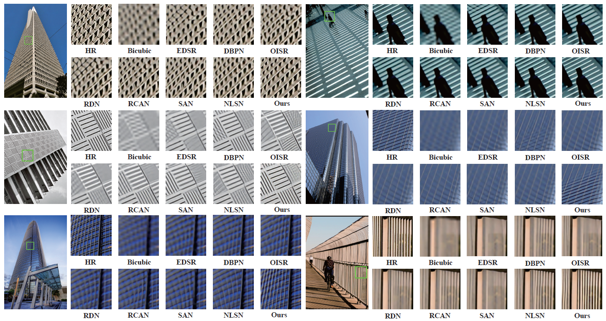

# ENLCA

This project is the official implementation of 'Efficient Non-Local Contrastive Attention for Image Super-Resolution', AAAI22
> **Efficient Non-Local Contrastive Attention for Image Super-Resolution [[Paper](https://arxiv.org/pdf/2201.03794.pdf)]**

## Contents
- [ENLCA](#enlca)
  - [Contents](#contents)
  - [Introduction](#introduction)
  - [Train](#train)
    - [Prepare training data](#prepare-training-data)
    - [Run](#run)
  - [Test](#test)
    - [Quick start](#quick-start)
  - [Results](#results)
    - [Quantitative Results](#quantitative-results)
    - [Visual Results](#visual-results)
  - [Citation](#citation)

## Introduction
Non-Local Attention (NLA) brings significant improvement for Single Image Super-Resolution (SISR) by leveraging intrinsic feature correlation in natural images. However, NLA gives noisy information large weights and consumes quadratic computation resources with respect to the input size, limiting its performance and application. In this paper, we propose a novel Efficient Non-Local Contrastive Attention (ENLCA) to perform long-range visual modeling and leverage more relevant non-local features. Specifically, ENLCA consists of two parts, Efficient Non-Local Attention (ENLA) and Sparse Aggregation. ENLA adopts the kernel method to approximate exponential function and obtains linear computation complexity. For Sparse Aggregation, we multiply inputs by an amplification factor to focus on informative features, yet the variance of approximation increases exponentially. Therefore, contrastive learning is applied to further separate relevant and irrelevant features. To demonstrate the effectiveness of ENLCA, we build an architecture called Efficient Non-Local Contrastive Network (ENLCN) by adding a few of our modules in a simple backbone. Extensive experimental results show that ENLCN reaches superior performance over state-of-the-art approaches on both quantitative and qualitative evaluations.


## Train
### Prepare training data 
1. Download DIV2K training data (800 training + 100 validtion images) from [DIV2K dataset](https://data.vision.ee.ethz.ch/cvl/DIV2K/) or [SNU_CVLab](https://cv.snu.ac.kr/research/EDSR/DIV2K.tar).

2. Specify '--dir_data' based on the HR and LR images path. 

Our code is based on EDSR. For more informaiton, please refer to [EDSR(PyTorch)](https://github.com/thstkdgus35/EDSR-PyTorch).

### Run
```shell
# x4 SR
CUDA_VISIBLE_DEVICES=6 python main.py --dir_data /media/data2/xiabin/datasets --n_GPUs 1 --rgb_range 1  --save_models --lr 1e-4 --decay 200-400-600-800 --epochs 1000 --chop --save_results --n_resblocks 32 --n_feats 256 --res_scale 0.1 --batch_size 16 --model ENLCN --scale 4 --patch_size 96 --save ENLCN_x4 --data_train DIV2K --data_test Set14

# x2 SR
CUDA_VISIBLE_DEVICES=6 python main.py --dir_data /media/data2/xiabin/datasets --n_GPUs 1 --rgb_range 1  --save_models --lr 1e-4 --decay 200-400-600-800 --epochs 1000 --chop --save_results --n_resblocks 32 --n_feats 256 --res_scale 0.1 --batch_size 16 --model ENLCN --scale 2 --patch_size 96 --save ENLCN_x2 --data_train DIV2K --data_test Set14
```


## Test
### Quick start

Pre-trained models can be downloaded from [google drive](https://drive.google.com/drive/folders/1jYdMA0ocnb-DAr71YhOduuCySOxhoAeX?usp=sharing). 

```shell
# x4 SR
CUDA_VISIBLE_DEVICES=6 python main.py --dir_data /media/data2/xiabin/datasets --n_GPUs 1 --rgb_range 1  --chop --save_results --n_resblocks 32 --n_feats 256 --res_scale 0.1 --batch_size 16 --model ENLCN --scale 4 --save ENLCN_x4 --data_test Set5+Set14+B100+Urban100 --pre_train ENLCAx4.pt --test_only

# x2 SR
CUDA_VISIBLE_DEVICES=6 python main.py --dir_data /media/data2/xiabin/datasets --n_GPUs 1 --rgb_range 1  --chop --save_results --n_resblocks 32 --n_feats 256 --res_scale 0.1 --batch_size 16 --model ENLCN --scale 2 --save ENLCN_x2 --data_test Set5+Set14+B100+Urban100 --pre_train ENLCAx2.pt --test_only
```

## Results
### Quantitative Results
PSNR/SSIM comparison on popular SR benchmark datasets is shown below (best in red, second best in blue).


### Visual Results
Visual comparison (x4)  is shown below.



## Citation
If you find the code helpful in your resarch or work, please cite our papers.
```
@article{xia2022efficient,
  title={Efficient Non-Local Contrastive Attention for Image Super-Resolution},
  author={Xia, Bin and Hang, Yucheng and Tian, Yapeng and Yang, Wenming and Liao, Qingmin and Zhou, Jie},
  booktitle={AAAI},
  year={2022}
}
```


